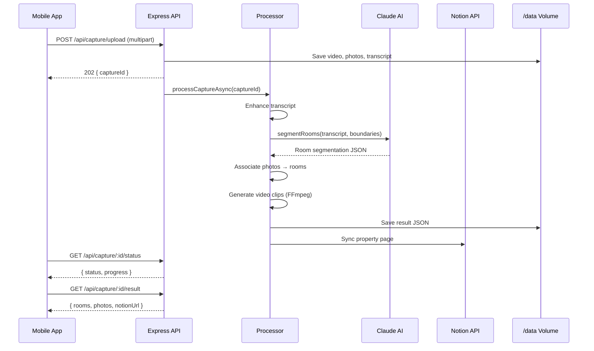

# Apollo Capture Backend — Specification

> **Repo:** `thomasbek3/apollo-capture-backend`
> **Stack:** Node 20 · Express · Claude AI · FFmpeg · Sharp · Notion SDK
> **Deploy:** Railway (Docker) · Volume at `/data`

---

## 1. Overview

Backend API for the Apollo property walkthrough tool. Accepts video, photos, and transcript data from the mobile capture app, processes them through an AI pipeline (Anthropic Claude), and syncs structured property data to Notion.

---

## 2. Architecture

```
str-onboardingapp/
├── src/
│   ├── index.js              # Express app entry point
│   ├── routes/
│   │   ├── capture.js         # Upload, status, result endpoints
│   │   └── health.js          # Health check
│   ├── services/
│   │   ├── claude.js           # Claude AI room segmentation
│   │   ├── processor.js        # Pipeline orchestrator
│   │   ├── notion.js           # Notion sync (create/update pages)
│   │   ├── storage.js          # File I/O on Railway volume
│   │   ├── ffmpeg.js           # Video clip generation
│   │   ├── photos.js           # Photo ↔ room association + thumbnails
│   │   └── transcript.js       # Transcript cleaning & normalization
│   ├── middleware/
│   │   └── upload.js           # Multer config (file validation, temp storage)
│   └── utils/
│       └── logger.js           # Winston structured logging
├── setup-notion.js             # One-time Notion DB setup script
├── test-notion.js              # Notion API smoke test
├── test-upload.js              # End-to-end upload test
├── read-pdf.js                 # Legacy PDF text extractor
├── Dockerfile                  # Node 20 + FFmpeg + Sharp
├── railway.toml                # Railway deployment config
├── package.json
├── .env.example
└── .gitignore
```

### Request Flow



---

## 3. API Endpoints

### `POST /api/capture/upload`
Upload a property capture (multipart/form-data).

| Field | Type | Required | Description |
|-------|------|----------|-------------|
| `video` | file | Yes | MP4 walkthrough video |
| `photos` | file[] | No | Up to 50 JPG/PNG photos |
| `transcript` | text | Yes | JSON array of `{text, timestamp}` |
| `metadata` | text | Yes | JSON with property info |
| `roomBoundaries` | text | No | JSON array of room boundary timestamps |
| `photoRoomAssignments` | text | No | JSON map of photo → room overrides |

**Response:** `202 { captureId, status: "processing" }`

### `GET /api/capture/:captureId/status`
Poll processing progress.

**Response:** `200 { captureId, status, progress, currentStep, steps, error? }`

### `GET /api/capture/:captureId/result`
Retrieve completed result.

**Response:** `200 { captureId, property, rooms[], photos[], notionPageUrl? }`

### `GET /api/health`
Health check.

**Response:** `200 { status, version, config: { notionConfigured, anthropicConfigured } }`

---

## 4. Processing Pipeline

| Step | Service | Description |
|------|---------|-------------|
| 1 | `transcript.js` | Merge duplicates, normalize terms, fix STT artifacts |
| 2 | `claude.js` | Claude segments transcript into rooms with inventory |
| 3 | `photos.js` | Match photos to rooms by timestamp or manual override |
| 4 | `ffmpeg.js` | Generate per-room video clips (optional, non-fatal) |
| 5 | `processor.js` | Compile final result JSON |
| 6 | `notion.js` | Create/update Notion page with structured property data |

---

## 5. Claude Prompt Strategy

- **Primary prompt:** Detailed system prompt requesting room-by-room JSON with name, condition, features, inventory, timestamps
- **Fallback prompt:** Simplified prompt used on retry if primary fails
- **Model:** Claude (via `@anthropic-ai/sdk`)
- **Retry:** 1 retry with fallback prompt on failure

---

## 6. Notion Page Structure

Each property syncs as a Notion page with:
- **Database properties:** Property Name, Address, Bedrooms, Bathrooms, Status, Capture Date
- **Page content:** Per-room toggle blocks containing condition assessment, features list, inventory table, photo gallery, video clip embed, transcript excerpt

---

## 7. Environment Variables

| Variable | Required | Default | Description |
|----------|----------|---------|-------------|
| `PORT` | No | `3000` | Server listen port |
| `ANTHROPIC_API_KEY` | **Yes** | — | Anthropic API key for Claude |
| `STORAGE_PATH` | No | `/data` | Persistent storage root |
| `NOTION_API_KEY` | No | — | Notion integration token |
| `NOTION_DATABASE_ID` | No | — | Target Notion database ID |
| `BACKEND_BASE_URL` | No | — | Public URL for photo/clip links in Notion |
| `LOG_LEVEL` | No | `info` | Winston log level |

---

## 8. Deployment

- **Platform:** Railway
- **Builder:** Dockerfile (Node 20 + FFmpeg + native deps)
- **Volume:** Mounted at `/data` for persistent file storage
- **Restart:** Automatic on failure (`railway.toml`)
- **Static files:** Served at `/api/files` from `STORAGE_PATH`

---

## 9. CORS Policy

Allowed origins:
- `http://localhost:5173`, `http://localhost:3000`, `http://localhost:3001`
- `https://apollo-capture.vercel.app`
- `https://apollo-capture-app.vercel.app`

> ⚠️ **Note:** Unknown origins are currently logged but **not blocked** (`callback(null, true)` for all).

---

## 10. File Storage Layout

```
/data/
├── captures/{captureId}/
│   ├── transcript.json
│   ├── metadata.json
│   └── photos/
├── results/{captureId}/
│   └── result.json
├── thumbnails/{captureId}/
│   └── {photoId}_thumb.jpg
├── clips/{captureId}/
│   └── {roomName}.mp4
└── temp/
    └── uploads/
```
